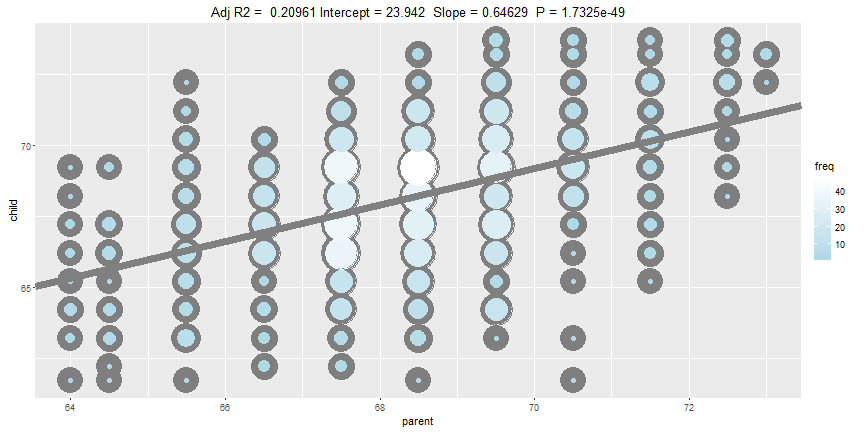

## Introduction  

People's health and care have been one of the principal motivations for modern science in last years, as a result of this, several indicators have been created as tools for infering the state and patterns about human body characteristics like pressure levels, diseases, quality of vision, height, weight, breathing frequency, nutrition... . Indicators like body mass index (BMI) , which is presented here, it can help us determining acceptable levels of our body behavior with the objective of bringing a healthy lifestyle.   

In the next slides will introduce some basic ideas of this interesting concept and finally present a practical exercise for calculating BMI: "BMI calcultor Sniny App""

---

## Body Mass Index

Body Mass Index (BMI) is a simple index of weight-for-height that is commonly used to classify underweight, overweight and obesity in adults. It is defined as the weight in kilograms divided by the square of the height in metres (kg/m2).  

Classification | BMI Principal cut-off points
---------------| ----------------------------
Underweight    | $<18.50$
Normal range   | $18.50 - 24.99$
Overweight     | $>=25.00$
Obese          | $>=30.00$                                                                                       

[World Health Organization](http://apps.who.int/bmi/)  
 
BMI values are age-independent and the same for both sexes. However, BMI may not correspond to the same degree of fatness in different populations due, in part, to different body proportions. The health risks associated with increasing BMI are continuous and the interpretation of BMI gradings in relation to risk may differ for different populations.

---

## Galton Data

This data set will use for estimating child height from mid parent heigths with a R linear regression method (lm). The estimated child height will server as one input for calculating BMI introduced before.
[View doc here, page 17] (https://cran.r-project.org/web/packages/HistData/HistData.pdf)

---

## BMI Calculator Shiny App

This sniny app calcualtes BMI of a child starting from de following value inputs:

*Nickname: child name and last name / child name  
*Gender: 'F' or 'M'  
*Weight: child's height  
*Mid parent heights: (father's height + mother's height)/2

Body Mass Index: $BMI= (weight / (height * height)) * 703$  

Additionally, the result shows the child classification accordance with estimated BMI: Underweight, Normal range, Overweight and Obese.  

Go to calculator https://juanpaboxu.shinyapps.io/bmi_index/  

